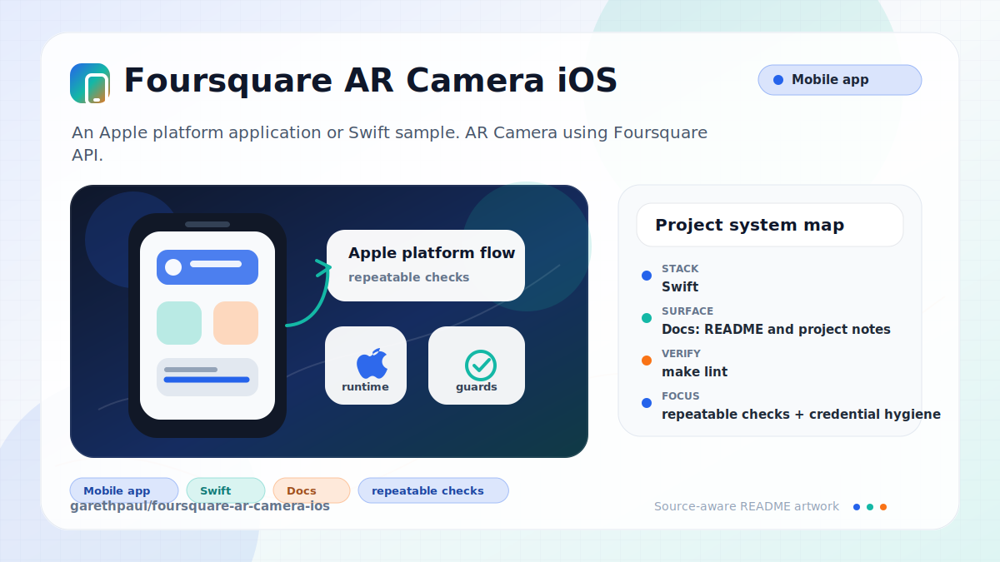

# foursquare-ar-camera-ios

<!-- README-OVERVIEW-IMAGE -->


## Overview

`garethpaul/foursquare-ar-camera-ios` is an Apple platform application or Swift sample. AR Camera using Foursquare API. 

This README is based on the checked-in source, manifests, scripts, and repository metadata on the `master` branch. The project language mix found during review was: Swift (18).

## Repository Contents

- `Podfile` - Apple platform dependency metadata
- `CHANGES.md` - concise history of maintenance changes
- `Makefile` - local verification entry point
- `FoursquareARCamera` - source or example code
- `FoursquareARCamera.xcodeproj` - Xcode project file
- `FoursquareARCamera.xcworkspace` - CocoaPods workspace to open after dependency install
- `Podfile.lock` - Apple platform dependency metadata
- `SECURITY.md` - security reporting and disclosure guidance
- `scripts/check-baseline.sh` - static credential, privacy, and project-shape checks
- `VISION.md` - project direction and maintenance guardrails

Additional scan context:

- Source directories: FoursquareARCamera
- Dependency and build manifests: Podfile, Podfile.lock
- Entry points or build surfaces: FoursquareARCamera.xcworkspace, FoursquareARCamera.xcodeproj
- Test-looking files: one standalone Swift behavioral harness under `Tests/`

## Getting Started

### Prerequisites

- Git
- macOS with Xcode for building Apple platform projects
- CocoaPods if dependencies need to be installed

### Setup

```bash
git clone https://github.com/garethpaul/foursquare-ar-camera-ios.git
cd foursquare-ar-camera-ios
pod install
```

The setup commands above are derived from repository files. Legacy mobile, Python, or JavaScript samples may require older SDKs or package versions than a modern workstation uses by default.

## Running or Using the Project

- Open `FoursquareARCamera.xcworkspace` in Xcode after `pod install`, choose the app or sample scheme, and run it on a physical device for AR/camera/location behavior.
- The Podfile targets the checked-in `FoursquareARCamera` native target. The
  CocoaLumberjack source selector is pinned to the exact Swift 4 commit already
  recorded by `Podfile.lock`.
- Configure `MAPBOX_ACCESS_TOKEN`, `FOURSQUARE_CLIENT_ID`, and `FOURSQUARE_CLIENT_SECRET` as local build settings, for example through an untracked `.xcconfig` file or Xcode scheme environment.

This is a preserved Swift 4.0 and iOS 11-era sample, not a current production
SDK baseline. The CocoaPods graph includes legacy dependencies, but
CocoaLumberjack no longer resolves a mutable branch: it uses commit
`f4294a13470d43260569d62aac6e1009fbef491a`. The checked-in Mapbox, ARKit/Core
Location, and Foursquare venue integration should be modernized in isolated,
device-verified changes rather than through an unreviewed bulk update.
The current lockfile records CocoaPods 1.3.1; any regenerated lockfile should
document the replacement CocoaPods version and dependency review.
The checked-in `PODFILE CHECKSUM` predates the commit-selector update and must
be regenerated with the legacy toolchain before claiming a fresh install.
`make check` parses the checked-in Xcode project when Xcode is available. Use
the workspace for functional builds only after generating Pods locally.

## Testing and Verification

Run the maintained baseline:

```bash
make lint
make test
make build
make check
```

Use the absolute Makefile path to run the same gates from another working
directory. Verification resolves the checker relative to the loaded Makefile
rather than the caller's directory.

The `lint`, `test`, and `build` targets delegate to the same baseline. When
`swiftc` is available, each gate compiles and runs the production Foursquare
response URL policy against accepted and hostile endpoints before the static
contracts. The baseline also verifies that credentials are build settings, tracked
machine artifacts are absent, location logs avoid detailed coordinates, and the
venue mask asset is not force-unwrapped. The workspace can be listed when
`xcodebuild` is installed. The venue tap interaction guard keeps one tap
recognizer on the scene and skips nodes without highlight materials. Location
and heading updates start only after Core Location authorization is available.
Location manager setup and heading forwarding avoid force-unwrapping optional
state.
Debug info label updates avoid force-unwrapping optional label text when partial
AR state is available. Reachability setup avoids force-unwrapping initialization
before showing offline state, and the dedicated connectivity probe succeeds only
for its expected HTTP 204 response. FSQView nib outlet setup is guarded before venue
card subviews are added. Map annotation updates avoid force-unwrapping optional
annotations while tracking the user and debug location estimate.
Foursquare venue lookup retries use a bounded cooldown when credentials are
missing, requests fail, or successful responses contain no valid venue payloads.
Venue lookup refuses redirects before sending venue query credentials, then
validates a 2xx HTTP status and the final HTTPS
api.foursquare.com endpoint and exact path. It also requires the exact
application/json response media type before JSON response parsing; rejected
responses use the same generic bounded retry path without logging response
data. The final URL decision is shared with the standalone executable harness,
so the tested predicate is the same source compiled into the app target.
Venue responses also require finite latitude/longitude within geographic bounds
and a finite nonnegative distance before rendering.

GitHub Actions runs `make check` on a bounded `macos-15` job for pushes and pull
requests. The checkout action is immutably pinned with read-only repository
permissions and runs without persisted checkout credentials. Hosted validation
also parses the checked-in Xcode project, but it does not install CocoaPods,
sign the app, exercise credentials, or replace physical-device verification.
The maintained workflow contract is documented in
[`docs/plans/2026-06-12-hosted-project-validation.md`](docs/plans/2026-06-12-hosted-project-validation.md).
The obsolete empty `ReadMe.md` case-variant was removed because default macOS
filesystems cannot safely check it out alongside this maintained `README.md`.

For functional verification, use Xcode's test action or `xcodebuild test` with
the appropriate scheme and destination.

When the required SDK or runtime is unavailable, use static checks and source review first, then verify on a machine that has the matching platform toolchain.

## Configuration and Secrets

- Detected references to Foursquare, Mapbox. Keep API keys, OAuth credentials, tokens, and account-specific values in local configuration only.
- Required local build settings: `MAPBOX_ACCESS_TOKEN`, `FOURSQUARE_CLIENT_ID`, and `FOURSQUARE_CLIENT_SECRET`.
- Do not commit `.xcconfig` files, API credentials, signing material, camera output, or user location data.

## Security and Privacy Notes

- Review changes touching authentication or token handling; examples from the scan include FoursquareARCamera/AppDelegate.swift, FoursquareARCamera/Source/Views/SceneLocationView.swift, FoursquareARCamera/ViewController.swift.
- Review changes touching external API calls or credential-adjacent configuration; examples from the scan include FoursquareARCamera/AppDelegate.swift, FoursquareARCamera/Source/Helpers/CGPoint+Extensions.swift, FoursquareARCamera/Source/Helpers/CLLocation+Extensions.swift, FoursquareARCamera/Source/Helpers/FloatingPoint+Radians.swift, and 6 more.
- Review changes touching network requests, sockets, or service endpoints; examples from the scan include FoursquareARCamera/Info.plist, FoursquareARCamera/Source/Reachability.swift, FoursquareARCamera/ViewController.swift, Podfile.
- Review changes touching mobile permissions or privacy-sensitive device data; examples from the scan include FoursquareARCamera/Info.plist, FoursquareARCamera/Source/Helpers/CLLocation+Extensions.swift, FoursquareARCamera/Source/Helpers/LocationManager.swift, FoursquareARCamera/Source/Helpers/LocationNode.swift, and 4 more.
- Review changes touching file, media, JSON, XML, CSV, OCR, or data parsing; examples from the scan include FoursquareARCamera/Info.plist, FoursquareARCamera/Source/Helpers/LocationNode.swift, FoursquareARCamera/Source/Helpers/UIImage-Extension.swift, FoursquareARCamera/ViewController.swift.
- Avoid logging detailed location coordinates, camera frames, Foursquare credentials, Mapbox tokens, or raw venue responses.
- Keep Core Location updates gated on authorization before starting AR venue
  lookup behavior.
- Keep location manager setup and heading forwarding resilient when optional
  Core Location state is unavailable.
- Keep debug info label updates resilient when only position, heading, or
  timestamp data is available.
- Keep reachability setup resilient so network-check initialization cannot crash
  before the offline alert path.
- Keep FSQView nib outlet setup resilient so missing or miswired venue card
  views do not crash rendering.
- Keep map annotation updates resilient so optional annotation state cannot
  crash user or debug location tracking.
- Keep Foursquare venue lookup retries bounded so missing credentials, failed
  requests, or empty/malformed responses do not trigger immediate request loops.

## Maintenance Notes

- This looks like an Apple platform project or sample. Xcode, Swift, CocoaPods, and deployment target versions may need to match the original project era.
- Run `make lint`, `make test`, `make build`, and `make check` before pushing
  changes that touch credentials, location/camera behavior, CocoaPods, or
  project files.
- See `SECURITY.md` for vulnerability reporting and safe research guidance.
- See `VISION.md` for project direction and contribution guardrails.
- See `docs/plans/2026-06-09-foursquare-ar-mask-asset-guard.md` for venue mask
  asset guardrails.
- See `docs/plans/2026-06-09-foursquare-ar-tap-interaction-guard.md` for venue
  tap interaction guardrails.
- See `docs/plans/2026-06-09-location-authorization-start-guard.md` for
  Core Location authorization startup guardrails.
- See `docs/plans/2026-06-09-location-manager-optional-guard.md` for
  LocationManager optional-state guardrails.
- See `docs/plans/2026-06-09-info-label-text-guard.md` for debug info label
  text guardrails.
- See `docs/plans/2026-06-09-reachability-init-guard.md` for reachability
  initialization guardrails.
- See `docs/plans/2026-06-09-make-gate-aliases.md` for local verification
  target guardrails.
- See `docs/plans/2026-06-09-fsq-view-nib-outlet-guard.md` for venue card nib
  outlet guardrails.
- See `docs/plans/2026-06-09-map-annotation-optional-guard.md` for map
  annotation optional-state guardrails.
- See `docs/plans/2026-06-09-foursquare-venue-lookup-retry-guard.md` for venue
  lookup retry guardrails.
- See `docs/plans/2026-06-13-foursquare-response-content-type-validation.md`
  for the exact JSON response media boundary.
- See `docs/plans/2026-06-14-foursquare-response-final-url-validation.md` for
  the final Foursquare response URL boundary.
- Foursquare venue networking uses a 15-second request timeout and a 30-second resource timeout.
- See `docs/plans/2026-06-10-legacy-sdk-modernization-boundary.md` for the
  legacy SDK and dependency modernization sequence.
- See `docs/plans/2026-06-12-hosted-project-validation.md` for the GitHub
  Actions and hosted Xcode project validation contract.
- See `docs/plans/2026-06-12-cocoapods-target-alignment.md` for the native
  target alignment and lockfile boundary.
- See `docs/plans/2026-06-13-cocoalumberjack-commit-pin.md` for the immutable
  CocoaLumberjack source boundary and Podfile-checksum limitation.

## Contributing

Keep changes small and tied to the project that is already present in this repository. For code changes, document the toolchain used, avoid committing generated dependency directories or local configuration, and update this README when setup or verification steps change.
